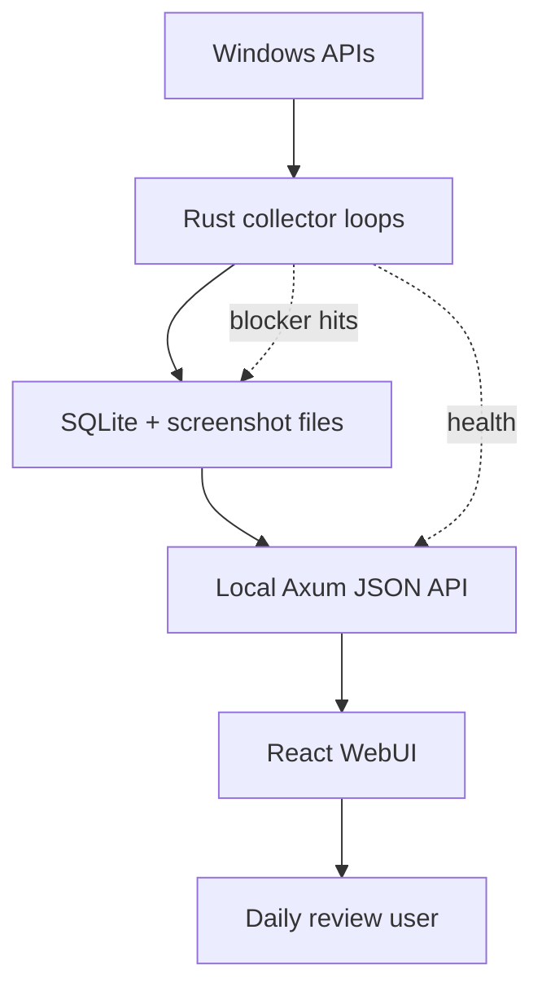

# Dayflow Engineering Knowledge

> Scope: this knowledge base documents the current `time-state-recorder` implementation as the local Dayflow reproduction baseline. It focuses on overall architecture, information flow, and core functions for the first acceptance round.

## Reading Order

1. [[01-overall-architecture]] - top-level system boundary, layers, runtime shape.
2. [[02-information-flow]] - event flows from Windows signals to SQLite, API, and WebUI.
3. [[03-core-functions]] - core product capabilities and where they live in code.
4. [[04-reproduction-boundaries]] - current Dayflow parity, gaps, risks, and next reproduction checkpoints.

## Current System In One Sentence

The project is a Windows-first, local-first activity recorder: a Rust collector samples OS activity into SQLite and screenshot files, an Axum API exposes normalized local JSON endpoints, and a React WebUI renders dashboard, timeline, daily screenshots, input activity, and collector health.

## Source Map

| Area | Primary Files | Role |
| --- | --- | --- |
| Collector CLI/runtime | `collector/src/main.rs`, `collector/src/api.rs` | Start modes, session lifecycle, collector loops, API server |
| Windows sampling | `collector/src/window.rs`, `collector/src/input.rs`, `collector/src/screenshot.rs` | Foreground window, Raw Input keyboard, screenshot thumbnail, idle detection |
| Privacy blocker | `collector/src/blocker.rs`, `collector/blocker_config.json` | Config-driven screenshot blocking and hit logging |
| Persistence | `collector/src/storage.rs`, `collector/src/models.rs` | SQLite schema, write/read methods, API/domain DTOs |
| Interval derivation | `collector/src/interval.rs` | Convert window focus and lifecycle facts into time intervals |
| Web API clients | `src/lib/api.ts`, `src/lib/input.ts`, `src/lib/screenshots.ts`, `src/lib/health.ts` | Typed fetch wrappers and runtime validation |
| Frontend model | `src/lib/statistics.ts`, `src/lib/uiModel.ts`, `src/lib/flowModel.ts`, `src/types.ts` | Derived metrics, timeline items, Today Flow Board buckets, layer/privacy/source state |
| Frontend views | `src/App.tsx`, `src/TodayFlowBoard.tsx`, `src/Dashboard.tsx`, `src/TimelineView.tsx`, `src/DailyTracking.tsx`, `src/InputActivity.tsx`, `src/CollectorMonitor.tsx` | User-facing Dayflow-like review workspace |
| Launcher/runtime | `scripts/start-user.ps1`, `scripts/stop-user.ps1`, `scripts/web-server.mjs` | One-click local run, PID/log management, static WebUI plus API proxy |

## Layer Summary

## 2026-05-24 v1.1.0 Vertical Slice

- Baseline: `time-state-recorder` release `v1.1.0`, commit `fd2b25b`.
- Goal: merge Dayflow's "time flow + evidence drawer" product grammar into the Windows-first recorder.
- Lower layer: keep Rust/Axum/SQLite and foreground polling, but expose collector observability for window capture status, screenshot skip reasons, and deduped capture-unavailable lifecycle facts.
- Upper layer: React WebUI now defaults to `TodayFlowBoard`, composed from `/api/time-events`, input summary, screenshot summary, and optional collector health.
- Privacy: redacted mode hides evidence titles and avoids raw text/screenshot row fetches unless a raw evidence view actually needs them; stale collector refreshes are generation-gated.
- Residual risk: foreground tracking is still polling-based, blocker audit rows remain a privacy surface, and full Windows event hooks/LLM summaries/API v2 are not implemented.

## Key Acceptance Notes

- Overall architecture is implemented as a local collector plus local WebUI, not a cloud service.
- Core information flows are window focus, lifecycle, keyboard/text segment, screenshot thumbnail, blocker hit, and collector health.
- Core UI functions are Today Flow Board, Dashboard, Timeline, Daily Tracking, Input Activity, and Collector Monitor.
- The current project has a Dayflow-like daily flow and evidence drawer surface, but not the full Dayflow workflow yet: no stable `/api/v2`, no query/chat interface, no weekly review, no LLM daily recap, and no export/cleanup workflow.
