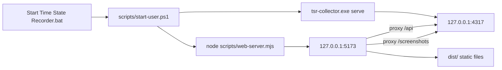
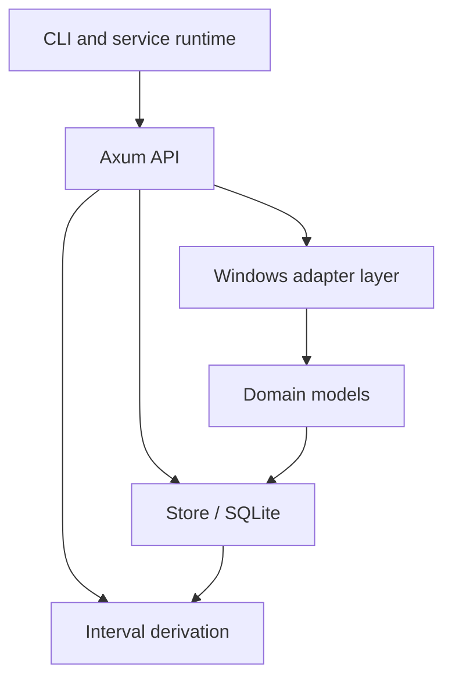
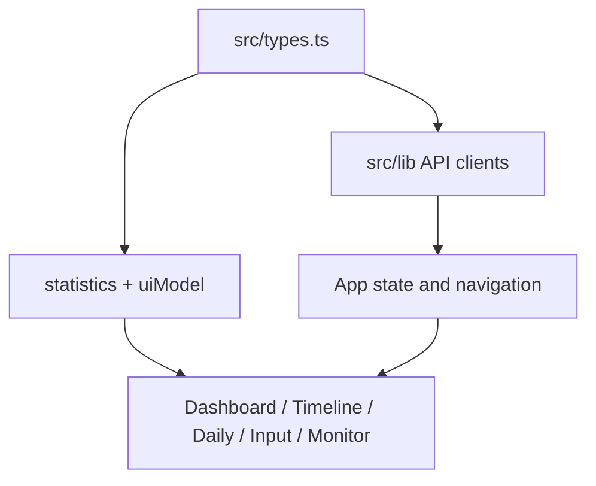

# Overall Architecture

## System Boundary

The current implementation is a local personal activity recorder. It does not send activity data to a remote service. The trust boundary is the local Windows machine:

- OS signals are read by the Rust collector.
- Raw facts are persisted locally in SQLite and screenshot thumbnail files.
- The API is bound to localhost.
- The WebUI reads from the same-origin local server or falls back to built-in sample data.

## Top-Level Runtime



Runtime facts:

- One-click start calls `scripts/start-user.ps1`.
- Collector default port is `127.0.0.1:4317`.
- WebUI default port is `127.0.0.1:5173`.
- The production-style local path serves `dist/` through `scripts/web-server.mjs`, not Vite.
- The web server proxies `/api` and `/screenshots` to the collector, preserving same-origin browser access.
- PID files live in `.launcher/collector.pid` and `.launcher/webui.pid`.
- Logs live under `logs/`.
- Primary database is `data/local.sqlite3`.
- Screenshot thumbnails live under `data/screenshots/YYYY-MM-DD/HH-MM.jpg`.

## Backend Layers



### 1. Windows Adapter Layer

This is the lowest implemented layer. It talks to OS APIs and emits normalized Rust structs.

- `collector/src/window.rs:5` exposes `sample_foreground_window()`.
- `collector/src/window.rs:26` implements the Windows foreground-window sample path.
- `collector/src/input.rs:143` exposes `spawn_input_collector()`.
- `collector/src/input.rs:250` creates the message-only Raw Input window.
- `collector/src/input.rs:341` handles `WM_INPUT`.
- `collector/src/screenshot.rs:10` captures the primary monitor thumbnail through `xcap`.
- `collector/src/screenshot.rs:33` computes idle seconds using `GetLastInputInfo`.

The code has non-Windows fallback branches, but the real product path is Windows-first.

### 2. Domain Model Layer

`collector/src/models.rs` is the shared vocabulary between collector, storage, API, and frontend.

Important groups:

- Window: `WindowSnapshot`, `CaptureStatus`, `StoredWindowEvent`.
- Time/lifecycle: `TimeEvent`, `TimeEventKind`, `LifecycleType`, `LifecycleEvent`.
- Screenshot: `ScreenshotMeta`, `ScreenshotSummary`, `AppScreenshotCount`.
- Input: `InputEventType`, `InputEvent`, `TextSegment`, `InputSummary`, `AppInputCount`.
- Health: `CollectorHealth`, `SubsystemHealth`, `DbStats`.
- Blocker: `BlockerConfig`, `BlockerRule`, `BlockerHit`.

### 3. Storage Layer

`collector/src/storage.rs` owns SQLite access through `Store`.

`Store::open()` enables WAL and foreign keys. `Store::init()` creates the current v1 tables:

- `capture_sessions`
- `raw_events`
- `window_events`
- `lifecycle_events`
- `blocker_hits`
- `screenshot_thumbnails`
- `input_events`
- `text_segments`

The architectural pattern is partly event-sourced:

- Window and lifecycle facts are written into `raw_events` plus specialized tables.
- Screenshot metadata, input events, and text segments are stored directly in specialized tables.
- Screenshot bytes are not stored in SQLite; they are JPEG files on disk.

### 4. Derivation Layer

`collector/src/interval.rs` builds frontend-friendly `TimeEvent` rows from raw window and lifecycle facts.

Core behavior:

- A window focus event ends at the next focus event in the same session.
- Lifecycle facts such as lock, suspend, idle start, collector gap, and session stop cut active window intervals.
- Some lifecycle pairs become system timeline intervals, for example lock to unlock.
- The last open interval can have no `endedAt` and no `durationSeconds`.

### 5. API Layer

`collector/src/api.rs` serves the local JSON API and static screenshot files.

Routes are registered in `router_from_state()`:

- `GET /api/health`
- `GET /api/window-events`
- `GET /api/lifecycle-events`
- `GET /api/time-events`
- `GET /api/blockers`
- `GET /api/screenshots`
- `GET /api/screenshot-summary`
- `GET /api/input-events`
- `GET /api/input-summary`
- `GET /api/text-segments`
- `POST /api/shutdown`
- Static: `/screenshots/...`

`api::serve()` starts collector loops and the Axum server together.

### 6. Runtime Orchestration Layer

`collector/src/main.rs` defines three CLI modes:

- `sample-once`: sample current foreground window and print JSON.
- `record`: record window focus events for a fixed duration.
- `serve`: start the long-running local API plus window, screenshot, and input collectors.

In `serve`, the collector:

1. Binds the localhost API port.
2. Closes stale sessions from previous abnormal exits.
3. Creates a new capture session.
4. Writes a `session_start` lifecycle event.
5. Starts three collectors: window, screenshot, and input.
6. Serves Axum until shutdown.
7. Aborts collector tasks and writes `session_stop`.

## Frontend Layers



### 1. Type Contract

`src/types.ts` mirrors collector API shapes:

- `TimeEvent`
- `ScreenshotMeta`
- `ScreenshotSummary`
- `InputEvent`
- `TextSegment`
- `InputSummary`
- `CollectorHealth`

### 2. API Client Layer

The frontend has separate fetch modules:

- `src/lib/api.ts`: `/api/time-events`.
- `src/lib/input.ts`: `/api/input-events`, `/api/input-summary`, `/api/text-segments`.
- `src/lib/screenshots.ts`: `/api/screenshots`, `/api/screenshot-summary`.
- `src/lib/health.ts`: `/api/health`.

The clients validate response shape manually. Health is tolerant and supplies fallbacks; time/input/screenshot clients throw on missing required fields.

### 3. Frontend Derivation Layer

`src/lib/statistics.ts` handles duration and app-level summaries. `src/lib/uiModel.ts` builds Dayflow-like review concepts:

- visible timeline filtering by layer;
- event-level timeline items;
- hourly timeline buckets;
- dashboard summary;
- input insight summary;
- duration formatting.

### 4. App State Layer

`src/App.tsx` owns:

- source mode: sample or live;
- privacy mode: redacted or raw;
- density mode: comfortable or compact;
- timeline granularity: event or hour;
- layer visibility: windows, lifecycle, input, screenshots;
- selected view: dashboard, timeline, daily, input.

`refreshCollector()` loads time events, input summary, optional text segments, screenshot summary, and optional screenshot rows in parallel.

Privacy behavior is important:

- In redacted mode, text segments and screenshot rows are not loaded into the UI.
- Raw mode is required to fetch/render raw text and screenshot evidence.
- Summary counts can remain visible when raw evidence is hidden.

### 5. View Layer

- `Dashboard`: aggregated daily review workspace.
- `TimelineView`: event-level or hourly active/lifecycle timeline.
- `DailyTracking`: screenshot summary and raw screenshot timeline.
- `InputActivity`: input summary, per-app character counts, text segment table.
- `CollectorMonitor`: 5-second health polling, subsystem status, DB stats.

## Current Architecture Shape

The implementation is not yet a fully modular event bus system. Collectors write through a shared `Arc<Mutex<Store>>`; this is simple and verifiable for MVP, but it means long-running capture, SQLite writes, and health updates are tightly coupled inside `api.rs`/`input.rs`.

For Dayflow reproduction, the current architecture is best described as:

```text
Windows signal recorder -> local evidence store -> local query API -> review dashboard
```

It is not yet:

```text
multi-source event bus -> policy-aware evidence service -> v2 timeline/query API -> Dayflow workflow suite
```

