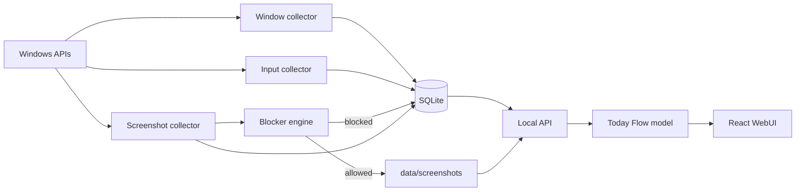
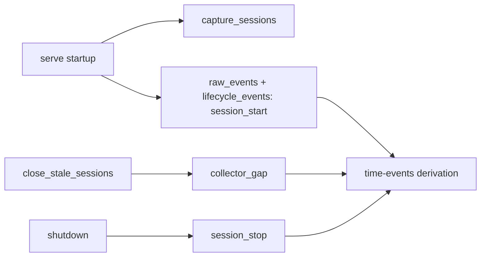
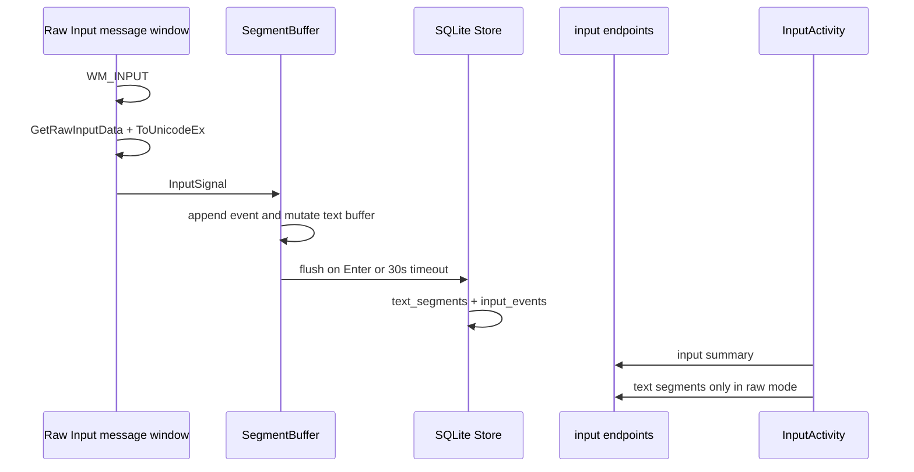
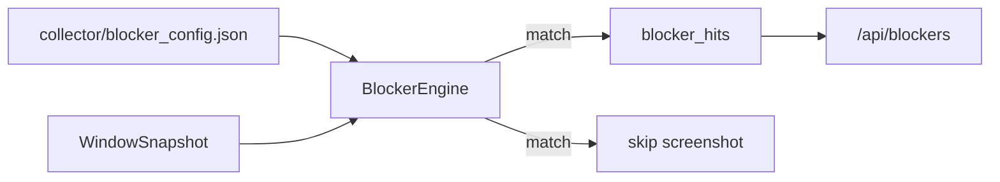
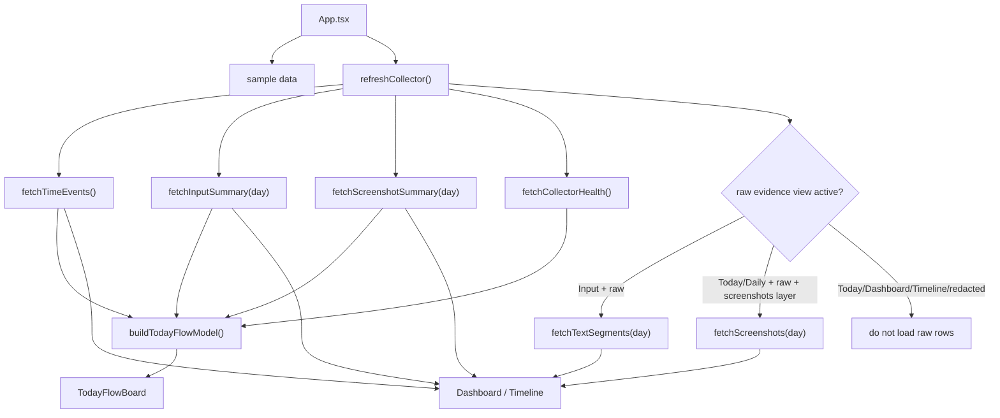

# Information Flow

## Overall Flow



The system has six important data streams:

1. Window focus stream.
2. Lifecycle stream.
3. Keyboard/input text stream.
4. Screenshot evidence stream.
5. Health and blocker stream.
6. Today Flow Board derivation stream.

## Window Focus Stream

```mermaid
sequenceDiagram
    participant OS as Windows foreground APIs
    participant Loop as spawn_collector_loop
    participant Store as SQLite Store
    participant API as /api/time-events
    participant UI as React UI

    Loop->>OS: sample_foreground_window()
    OS-->>Loop: WindowSnapshot
    Loop->>Loop: compare (hwnd, pid, title)
    Loop->>Store: insert_window_focus()
    Store->>Store: raw_events + window_events
    API->>Store: list_window_events()
    API->>Store: list_lifecycle_events()
    API->>API: build_time_events_with_lifecycle()
    UI->>API: fetchTimeEvents()
```

Implementation facts:

- Poll interval defaults to 1000 ms.
- Window identity is `(hwnd, pid, window_title)`.
- A new row is written only when identity changes.
- Successful samples update `windowCollector.lastCaptureStatus` even when identity does not change.
- Repeated foreground sample failures are deduped before writing `capture_unavailable` lifecycle facts.
- `raw_events.event_type = 'window_focus'`.
- Specialized window fields are duplicated into `window_events`.
- `TimeEvent` intervals are derived at query time, not stored.

Important files:

- `collector/src/api.rs:218` - window collector loop.
- `collector/src/window.rs:26` - Windows foreground sampling.
- `collector/src/storage.rs:332` - write path.
- `collector/src/storage.rs:377` - read path.
- `collector/src/interval.rs:9` - interval derivation.
- `src/lib/api.ts:5` - frontend fetch.

## Lifecycle Stream



Current lifecycle facts are mostly service/session lifecycle, not full Windows session telemetry.

Implemented facts:

- Startup writes `session_start`.
- Graceful stop writes `session_stop`.
- Previous open sessions are closed on restart and get `collector_gap`.
- Lifecycle facts can cut active window intervals.
- Lifecycle pairs such as lock/unlock and suspend/resume are modeled, but real Windows message capture for those is not yet wired.

Important files:

- `collector/src/storage.rs:146` - create session.
- `collector/src/storage.rs:168` - close session.
- `collector/src/storage.rs:197` - close stale sessions.
- `collector/src/storage.rs:260` - insert lifecycle event.
- `collector/src/api.rs:171` - service startup and shutdown.
- `collector/src/interval.rs:106` - lifecycle events that cut active intervals.

## Keyboard And Text Segment Stream



Implemented behavior:

- A dedicated thread creates a message-only window.
- It registers the keyboard device with `RIDEV_INPUTSINK`.
- `WM_INPUT` is decoded into `InputSignal`.
- Foreground window metadata is sampled at input event time.
- `ToUnicodeEx` maps keydown to characters using the foreground keyboard layout.
- `SegmentBuffer` builds text segments.
- Enter flushes a segment and appends `\n`.
- 30 seconds without input flushes a segment.
- Backspace mutates the internal text buffer with `pop()` and increments `backspaceCount`.
- Delete increments `deleteCount`, but does not know what text was deleted.

Persistence:

- `text_segments` stores reconstructed plaintext, counts, time range, and foreground window metadata.
- `input_events` stores raw keydown/keyup rows linked by `segment_id`.
- These tables currently do not have `session_id`.

Important files:

- `collector/src/input.rs:143` - spawn input collector.
- `collector/src/input.rs:250` - raw input loop setup.
- `collector/src/input.rs:341` - `WM_INPUT` handler.
- `collector/src/input.rs:65` - segment ingest.
- `collector/src/input.rs:102` - segment flush.
- `collector/src/storage.rs:586` - input segment write.
- `collector/src/api.rs:572` - input endpoints.
- `src/lib/input.ts:25` - input summary fetch.
- `src/InputActivity.tsx:30` - input view.

Dayflow reproduction warning:

The current stream is a key-derived text approximation. It does not reliably capture Chinese IME committed text, paste, selection replacement, or true Delete-after-cursor semantics.

## Screenshot Evidence Stream

```mermaid
sequenceDiagram
    participant Loop as screenshot loop
    participant Idle as GetLastInputInfo
    participant Win as foreground window sample
    participant Block as BlockerEngine
    participant FS as screenshot files
    participant Store as SQLite Store
    participant UI as DailyTracking

    Loop->>Idle: idle_seconds()
    Loop->>Win: sample_foreground_window()
    Loop->>Block: is_blocked("screenshot")
    alt blocked
        Block-->>Store: blocker_hit
    else allowed
        Loop->>FS: write YYYY-MM-DD/HH-MM.jpg
        Loop->>Store: insert_screenshot(metadata)
        UI->>Store: via /api/screenshots and /api/screenshot-summary
    end
```

Implemented behavior:

- Default screenshot interval is 60 seconds.
- Default idle threshold is 120 seconds.
- The collector captures the primary monitor only.
- Thumbnail width is capped at 640 px.
- Files are JPEGs under `data/screenshots/YYYY-MM-DD/HH-MM.jpg`.
- Metadata is stored in `screenshot_thumbnails`.
- Non-ok screenshot skip attempts are also stored as metadata-only rows for skip-reason aggregation.
- Normal screenshot list and success summary metrics filter to `capture_status = 'ok'`.
- Blocked screenshot skip rows drop process/title metadata before persistence.
- Summary counts can be shown in redacted mode.
- Raw image rows are fetched/rendered only when screenshots layer is enabled and privacy mode is raw.

Important files:

- `collector/src/api.rs:276` - screenshot collector loop.
- `collector/src/screenshot.rs:10` - thumbnail capture.
- `collector/src/screenshot.rs:33` - idle detection.
- `collector/src/blocker.rs:28` - blocker check.
- `collector/src/storage.rs:475` - screenshot metadata write.
- `collector/src/api.rs:528` - screenshot API.
- `src/lib/screenshots.ts:5` - screenshot fetch.
- `src/DailyTracking.tsx:34` - screenshot timeline view.

Known implementation detail:

`capture_thumbnail(max_width, _quality)` accepts a quality argument, but the current JPEG write path does not apply it.

## Blocker Hit Stream

Blockers are privacy gates before capture. The current active use is screenshot blocking.



Implemented behavior:

- Config is JSON.
- Supported fields: `process_name`, `window_title`, `exe_path_hash`.
- Supported operators: `equals`, `contains`, `starts_with`.
- Matched screenshot rules prevent screenshot file creation.
- Hits are written to `blocker_hits`.

Important gap:

`blocker_config.json` contains a `text_capture` rule, but the current input collector path does not execute text-capture blocker rules. This must be treated as a gap, not as implemented privacy coverage.

## WebUI Loading Flow



Implemented behavior:

- App starts with sample data.
- On mount, it attempts live collector refresh.
- Time events are the primary timeline source.
- `TodayFlowBoard` is the default view.
- The board derives buckets and evidence labels in `src/lib/flowModel.ts`.
- It receives summaries and health by default; raw screenshot rows are loaded only for Today/Daily when raw mode and the screenshots layer are both active.
- Redacted mode replaces evidence titles with `Hidden in redacted mode`.
- Raw Today mode can reveal evidence titles and render overlapping screenshot thumbnails in the evidence drawer, but text segments remain scoped to Input Activity.
- Raw rows are only fetched when the active view needs them.
- `refreshCollector()` uses a generation guard so older async responses cannot overwrite newer privacy/source/view state.
- Input summary and screenshot summary can be live even when raw evidence is hidden.
- Text segments and screenshot rows are privacy-gated.
- Failures keep currently visible data and surface notices.

Important files:

- `src/App.tsx` - app state owner, refresh generation guard, view routing.
- `src/lib/flowModel.ts` - Today Flow Board derivation.
- `src/TodayFlowBoard.tsx` - daily flow and evidence drawer surface.
- `src/CollectorMonitor.tsx:43` - health monitor.
