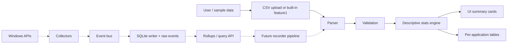

# MVP Information Flow

This document explains how information moves through the current WebUI MVP and how that path maps to the future local recorder infrastructure.

## Current Flow

The current MVP is browser-side analysis only. Data enters through a CSV upload or built-in `feature1` sample, is parsed into active-window records, validated, analyzed, and rendered in UI summaries.

## Step Details

User/data entry:

- User chooses a CSV file, or the app loads the built-in `feature1` active-window sample.
- No background recorder is started by the MVP.
- No data leaves the local browser/dev server.

Parser:

- Converts CSV/sample rows into normalized active-window records.
- Reports row-numbered validation errors while the UI keeps the source CSV text visible for review.
- Accepts records with either explicit duration or enough timestamps to derive duration.

Validation:

- Requires an application/process label.
- Requires valid duration data.
- Rejects negative, missing, or non-numeric durations.
- Flags malformed timestamps instead of letting analysis fail later.

Descriptive stats engine:

- Computes row count, total duration, mean, median, standard deviation, min, max, Q1, and Q3.
- Groups durations by application/process.
- Produces display-ready summaries without changing the original records.

UI cards/tables:

- Cards show global metrics at a glance.
- Tables show per-application active duration and event counts.
- Validation output should be visible and actionable for bad CSV input.

Future recorder pipeline:

- Windows collectors will create raw events.
- A bounded event bus will decouple collectors from storage.
- SQLite will store append-only raw events and derived rollups.
- A local API or export layer will feed the same logical records into the WebUI.

## Current MVP vs Future Infrastructure

Current UI MVP owns:

- CSV/sample loading.
- Browser-side parsing and validation.
- Descriptive statistics.
- Per-application summaries.
- Static UI rendering.

Future collector/storage infra owns:

- Windows foreground-window observation.
- Raw event creation, including `window_focus` events.
- Capture status handling for lock screen, UAC, permission errors, and unavailable windows.
- SQLite WAL storage and retention policy.
- Interval/rollup generation from raw events.
- Local API or CLI export for the WebUI.

Boundary rules:

- The UI should not call Windows APIs directly.
- The parser should accept exported recorder data without knowing how it was captured.
- Raw events and derived rollups should remain reproducible; do not overwrite raw source rows during analysis.
- Privacy-sensitive fields, especially window titles, must be optional and redaction-friendly.
