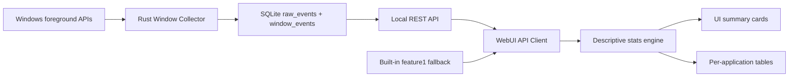

# MVP Information Flow

This document explains how information moves through the live collector MVP and how that path maps to the future local recorder infrastructure.

## Current Flow

The current MVP has a real local backend. The Rust collector samples Windows foreground-window state, writes SQLite rows, exposes JSON over a local REST API, and the WebUI renders descriptive statistics from that API.

## Step Details

Collector:

- `sample-once` reads the current foreground window.
- `record` writes focus changes for a bounded period.
- `serve` runs the polling collector and local REST API in one process.

Storage:

- SQLite stores append-only `raw_events` and `window_events`.
- Raw event payloads preserve the sampled window snapshot as JSON.
- The open interval is derived at query time and has no `endedAt` until the next focus event.

API:

- `/api/health` reports local backend health.
- `/api/window-events` returns raw joined focus events.
- `/api/time-events` returns interval-shaped records for the WebUI.

Descriptive stats engine:

- Computes row count, total duration, mean, median, standard deviation, min, max, Q1, and Q3.
- Groups durations by application/process.
- Produces display-ready summaries without changing the original records.

UI cards/tables:

- Cards show global metrics at a glance.
- Tables show per-application active duration and event counts.
- Validation output should be visible and actionable for bad API payloads or empty collector responses.

Future recorder pipeline:

- Event-driven `SetWinEventHook` can replace or augment polling.
- A bounded event bus will decouple collectors from storage.
- Derived rollups can be persisted for faster queries.
- Server-Sent Events or WebSocket streaming can push live focus changes.

## Current MVP vs Future Infrastructure

Current WebUI owns:

- REST client for `/api/time-events`.
- Built-in sample fallback.
- Descriptive statistics.
- Per-application summaries.
- Static UI rendering.

Current collector/storage owns:

- Windows foreground-window polling.
- Raw event creation, including `window_focus` events.
- Capture status handling for lock screen, UAC, permission errors, and unavailable windows.
- SQLite WAL storage.
- Interval generation from raw events.
- Local REST JSON API for the WebUI.

Boundary rules:

- The UI should not call Windows APIs directly.
- Browser UI access should use the local `/api` proxy or a future same-origin shell; the collector must not expose permissive CORS for private activity data.
- The WebUI API client should accept recorder query data without knowing how it was captured.
- Raw events and derived rollups should remain reproducible; do not overwrite raw source rows during analysis.
- Privacy-sensitive fields, especially window titles, must be optional and redaction-friendly.
