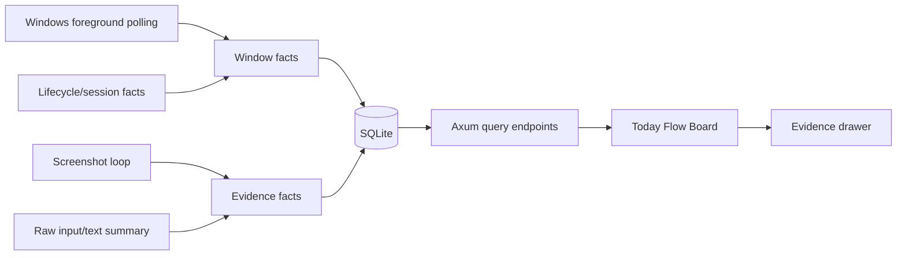

# Dayflow Vertical Slice On v1.1.0 Design

Date: 2026-05-24

## Goal Contract

目标：在 `time-state-recorder` 最新 release `v1.1.0` 基线上，做一个可验收的 Dayflow 风格垂直切片：下层增强 Windows 进程/窗口追踪稳定性，上层形成稳定的日内时间流向看板。

上下文：

- 代码基线：GitHub release `Time State Recorder v1.1.0`，tag `v1.1.0`，commit `fd2b25b`。
- 当前工作分支：`codex/dayflow-vertical-slice-v1.1.0-20260524-232729`，从 `v1.1.0` 切出。
- Dayflow 参考：自动时间线、每日回顾、证据链、隐私默认保护、从原始事实派生工作日叙事。
- 本项目底座：Rust/Axum/SQLite collector，React/Vite WebUI，Windows-first，本地优先。

约束：

- 不直接移植 Dayflow 的 macOS/SwiftUI/ScreenCaptureKit 代码，只吸收产品逻辑和信息流。
- 不引入云同步、LLM 总结、Notion 导出或长期 schema 重构。
- 不让 active interval 跨 collector session、lock/suspend/shutdown/abnormal stop 边界。
- redacted 模式下不展示截图原图、窗口标题细节或文本片段证据。
- 保留当前 release 架构，不把本轮变成完整 v2 API 或完整 analyzer 重写。

验收标准：

- WebUI 第一层能展示可扫描的 Today Flow Board，表达 active、idle/offline、uncertain、input intensity、screenshot evidence。
- Collector 或 analyzer 对关键不确定性有可观测事实，至少包括 session boundary、capture unavailable、screenshot skipped reason 或 polling fallback 状态。
- 日内看板不把跨 session 的空白误算为连续工作。
- 隐私模式切换后，敏感证据不会因为异步响应回流到界面。
- 通过 `cargo fmt --all`、`cargo test -p tsr-collector -- --nocapture`、`cargo build -p tsr-collector`、`npm test -- --run`、`npm run build`。

输出物：

- 一个 Dayflow 风格 Today Flow Board UI 切片。
- 必要的 Rust collector/API 轻量增强。
- 对应 TypeScript/Rust 测试。
- 更新后的 `docs/dayflow-engineering-knowledge` 或同等 Obsidian markdown 记录，说明本轮合并后的架构和残余风险。

## Release Baseline Handling

本轮从 `v1.1.0` 开始重构，而不是继续叠在旧的 UI 实验分支上。当前已有的未提交 UI 隐私改动已用 git stash 保存，原 ahead 分支也保留。实施阶段可以选择重新实现其中的隐私保护思想，但不能盲目恢复旧分支的全部 UI 变更。

原因：

- `v1.1.0` 已包含 lifecycle-aware timeline 原型，是稳定性增强的正确基线。
- 旧分支包含 Toggl-style UI 实验，与 Dayflow 垂直切片目标并不完全一致。
- 从 release 切出可以让后续 diff 更容易审查和回滚。

## Product Shape

本轮第一屏应从“统计卡 + 原始表格”转向“今天的时间流”。用户打开应用后先回答三个问题：

1. 今天时间去了哪里。
2. 哪些时间段有可靠证据，哪些时间段不确定。
3. 点击某个时间段后，能看到支撑它的窗口、输入、截图和 collector 状态。

推荐布局：

- 左侧：Today summary，展示 active time、uncertain gaps、screenshot coverage、input activity。
- 中间：日内时间流主轴，以小时行或 15 分钟 bucket 展示 app/category/lifecycle 状态。
- 右侧：Evidence drawer，展示选中区间的窗口事实、输入强度、截图证据、collector 状态和不确定性原因。
- 顶部保留 source/sample、privacy redacted/raw、density、layer toggles，但默认视图应服务 Today Flow Board。

## Architecture

本轮保留现有边界，只做窄切片增强：

关键原则：

- Collector 继续写原始事实，UI 不伪造 collector 状态。
- Analyzer/query 层负责把事实切成日内 interval 或 bucket。
- UI 只展示可信程度，不把缺失数据解释成工作。
- 隐私 gate 在 API 请求触发和响应落地两处都要生效，避免 stale raw response。

## Collector Stability Slice

本轮不做完整事件驱动 Windows hook 重写，但要让当前 polling 模型更稳定、可解释。

最小增强：

- 前台窗口 identity 继续以 hwnd、pid、title 为核心，但 session/lifecycle 边界必须重置 `last_identity`。
- 当 foreground capture 返回 `NoForegroundWindow`、`PermissionDenied`、`Unavailable` 时，写入或暴露 capture unavailable 事实，而不是只在内存 health 中丢失。
- screenshot loop 对 idle、blocked、capture unavailable、write failure 等跳过原因形成可查询事实或 summary 字段。
- time-events 派生逻辑必须把 lifecycle interval 和 collector gap 作为硬边界。
- health endpoint 显示 window polling fallback 状态、最近 capture error、最近 screenshot skipped reason。

后续版本可再引入 `SetWinEventHook(EVENT_SYSTEM_FOREGROUND)` 和 `EVENT_OBJECT_NAMECHANGE`，但本轮只把它作为可选后续，不作为完成条件。

## API And Data Flow

优先复用现有 endpoints：

- `/api/time-events`：Today Flow Board 的主时间流来源。
- `/api/lifecycle-events`：用于标注 session/lifecycle 边界。
- `/api/input-summary`：用于 input intensity，不默认加载 raw text。
- `/api/screenshots` 和 `/api/screenshot-summary`：用于 evidence marker 和 raw 模式截图详情。
- `/api/health`：用于 collector health 和稳定性面板。

如现有 response 不足，优先加向后兼容字段，而不是新增大范围 v2 API。可新增的轻量字段包括：

- interval/bucket `confidence`：`high`、`partial`、`uncertain`。
- interval/bucket `boundaryReason`：`session_start`、`session_stop`、`collector_gap`、`idle`、`capture_unavailable`。
- screenshot summary `skippedReasons`：按原因计数。
- health `lastWindowCaptureStatus`、`lastScreenshotSkipReason`。

## UI Components

新增或重组以下前端单元：

- `TodayFlowBoard`：视图容器，负责布局、状态聚合和选择区间。
- `DayFlowLane`：日内主轴，支持 event/hour bucket 两种密度。
- `FlowSummaryPanel`：active、uncertain、evidence coverage、input activity 摘要。
- `EvidenceDrawer`：选中 interval 的证据面板，受 privacy mode 控制。
- `flowModel` helpers：把 API time events、input summary、screenshot summary 转成 UI 可渲染 buckets。

设计限制：

- 不把所有逻辑塞进 `App.tsx`。
- 不在 UI 中重新推断 collector lifecycle 事实。
- 不在 redacted 模式下渲染 raw screenshot rows、window title 明细或 text segments。
- 桌面优先，但主要看板在窄屏下应退化为 summary、flow lane、drawer 的纵向堆叠。

## Error Handling

Collector/API：

- DB 写入失败要进入 health 状态并在测试中覆盖。
- capture unavailable 不等同于 idle，不应计为 active。
- screenshot blocked/idle/capture failed 都要与截图成功区分。
- session abnormal stop 后的 gap 由 lifecycle-aware logic 显式呈现。

Frontend：

- API 失败时保留 sample data fallback，但必须标记 source mode。
- raw request 的异步响应如果在 privacy mode 变回 redacted 后返回，必须丢弃。
- layer toggle 关闭 screenshots 后，旧截图 rows 不应继续显示。
- evidence drawer 对缺失证据显示原因，而不是空白。

## Testing Plan

Rust：

- lifecycle boundary 不允许 active interval 跨 session。
- foreground capture unavailable 产生可查询状态。
- screenshot skipped reason 进入 summary 或 health。
- existing lifecycle tests 保持通过。

TypeScript：

- redacted 模式不渲染 screenshot/text/window-title raw evidence。
- stale raw response 被丢弃。
- flow model 能把 active、lifecycle、gap、screenshot/input summary 合成 buckets。
- Today Flow Board 在 sample mode 和 live mode 都能渲染关键区域。

Manual verification：

- `npm run dev` 或 `npm run serve:app` 打开看板，检查首屏是否是 Today Flow Board。
- 切换 redacted/raw、screenshots layer、input layer，确认敏感证据不会泄露。
- 启动 collector，停止后重启，确认 session gap 在日内流中可见。

## Out Of Scope

- LLM 日报、周报、chat over timeline。
- Notion 同步。
- Wearable、WeChat、外部图片 lifelog 导入。
- 完整 API v2 和 schema migration framework。
- 完整 Windows event hook collector 替代 polling。
- 自动分类模型或复杂 app category taxonomy。

## Agent Decomposition For Implementation

实施时采用主 agent 聚合、subagents 分层探索的方式：

- Collector subagent：检查 `collector/src/api.rs`、`window.rs`、`storage.rs`、lifecycle 派生测试，提出最小稳定性 patch。
- UI subagent：检查 `src/App.tsx`、timeline/daily/input 组件和样式，提出 Today Flow Board 组件边界。
- Verification subagent：独立检查隐私 gate、session gap、测试覆盖和文档更新是否满足验收。

主 agent 负责合并方案、避免多 agent 修改同一文件、执行最终测试和记录工程知识。

## Residual Risks

- polling 模型仍可能漏掉极短窗口切换，本轮只提高可解释性，不承诺完整进程审计。
- Windows lock/suspend 事件如果 release 中还没有实时捕获，本轮只能依赖已有 lifecycle/session facts 和 abnormal gap。
- screenshot skip facts 如果需要 schema 改动，必须保持向后兼容。
- UI bucket 分类初版可能只按 process/window/app group 展示，不做语义工作分类。
