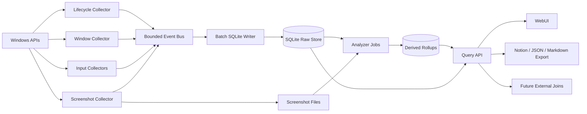

# Next Iteration Architecture Design

Date: 2026-05-24

## Goal

Prepare the next Time State Recorder iteration without implementing feature code yet. The design covers:

- Feature 1: Windows lock, shutdown, suspend, resume, logoff, and abnormal stop handling in statistics.
- Feature 2: A more useful Dayflow-inspired WebUI and stronger data interfaces.
- Feature 3: Input Activity improvements for Chinese IME, typo/correction behavior, and human-system interaction signals.
- Feature 4: Notion Principle integration, richer statistics, custom query APIs, and API documentation.
- Feature X: extensible attention-management metrics that can later combine wearables, Notion records, WeChat records, and image-heavy lifelogging.

The current codebase is a local-first Rust/Axum collector, SQLite storage, and React/Vite WebUI. This design keeps that shape and adds boundaries rather than replacing the stack.

Naming note: this document follows the user's next-iteration labels. The current repository README labels keyboard input as Feature 2 and screenshots as Feature 3; here, "Feature 3" means the next Input Activity/IME/product-behavior iteration, not the existing screenshot feature.

## Product Direction

The next version should shift from "tables of captured events" to "an observable personal workday." Dayflow is the closest product reference: it emphasizes an automatic timeline, daily standup, weekly analytics, chat over the work journal, context-aware summaries, local-first privacy, and cleanup controls. Time State Recorder should adapt that product grammar for Windows and Chinese workflows:

- Timeline first: users should be able to scan a day chronologically before drilling into raw rows.
- Explainable metrics: every score should link back to events, rollups, screenshots, or text/edit signals.
- Local-first by default: all sensitive data stays local unless an export or integration is explicitly enabled.
- Queryable substrate: Notion export, future wearable joins, and future chat interfaces should all use the same typed query layer.

References:

- https://github.com/JerryZLiu/Dayflow
- https://www.dayflow.so/

## Existing Architecture

Current collector modules:

- `collector/src/window.rs` polls `GetForegroundWindow` and records `WindowSnapshot`.
- `collector/src/input.rs` uses Raw Input in a message-only window thread and buffers text segments.
- `collector/src/screenshot.rs` captures thumbnails and uses `GetLastInputInfo` for idle detection.
- `collector/src/storage.rs` owns schema creation and query helpers.
- `collector/src/api.rs` runs Axum endpoints, collector loops, health state, screenshot serving, and query handlers.

Current WebUI modules:

- `src/App.tsx` owns top-level navigation and statistics view.
- `src/DailyTracking.tsx` renders screenshot timeline by hour.
- `src/InputActivity.tsx` renders input summaries and text segments.
- `src/CollectorMonitor.tsx` renders subsystem health.
- `src/lib/*.ts` files validate API responses.
- `src/lib/statistics.ts` computes UI-side descriptive statistics from time events.

Important current limits:

- Window statistics infer intervals only from focus events; they do not know why a gap happened.
- `CaptureStatus` has no explicit `locked`, `shutdown`, `suspend`, `resume`, or `session_end` states.
- The screenshot loop silently skips idle/blocked/unavailable cases, which makes later statistics ambiguous.
- Input text reconstruction is key-code based and does not reliably model Chinese IME committed text.
- API endpoints are feature-specific and list-oriented; there is no stable query layer for rollups, Notion export, or external data joins.
- Derived analysis is split between Rust and frontend TypeScript, so reproducibility will degrade as metrics become richer.
- Schema creation uses `CREATE TABLE IF NOT EXISTS` without an explicit migration/version system, which is not enough for Feature X schema evolution.
- `Store` currently mixes schema creation, writes, query helpers, summaries, and health stats. This is acceptable for the MVP but should not absorb all future query and metric logic.

## Architecture Principles

1. Preserve raw facts. Raw collector events must be append-only and never overwritten by analysis.
2. Make absence observable. Lock screen, suspend, shutdown, idle skip, blocked capture, and permission failure are first-class facts, not missing rows.
3. Derive statistics from typed rollups. Daily, minute, session, and project metrics should be rebuildable from raw events plus deterministic analyzers.
4. Treat input as layered signals. Physical keys, IME composition, committed text, edit intent, and text-diff confidence are different event types.
5. Keep Notion and future data sources outside the collector hot path. Integrations read from export/query services and write sync state separately.
6. Keep privacy policy executable. Blocker rules, retention rules, field redaction, export scope, and provenance should be data model concepts.
7. Favor small stable interfaces. Collectors publish events; storage writes; analyzers derive; API queries; UI renders.

## Target Module Boundaries



Recommended modules:

- `collector/src/lifecycle.rs`: Windows session lifecycle capture, power events, graceful shutdown handling, and synthetic lifecycle events.
- `collector/src/event_bus.rs`: bounded channel, event priority, drop policy, and queue metrics.
- `collector/src/events.rs`: typed internal event enum shared by collectors and writer.
- `collector/src/migrations/`: explicit schema migrations and schema version checks.
- `collector/src/analyzer/`: deterministic rollups for intervals, minutes, sessions, input behavior, screenshot coverage, and attention metrics.
- `collector/src/query/`: query DTOs and repository methods for API v2.
- `collector/src/integrations/`: sync state and export adapters, starting with Notion Principle.
- `src/api/` or `src/lib/apiV2.ts`: frontend API clients grouped by query domain instead of one file per endpoint.
- `src/views/`: route-level UI views: Today Timeline, Weekly Review, Input Behavior, Query Explorer, Settings.

Query handlers should use read-only SQLite connections or a small read pool and run blocking `rusqlite` work outside the async reactor. Collector writes must not wait behind long day/week reports or custom metric queries.

## Schema Evolution And Source Foundation

Before adding Notion, wearables, WeChat, or lifelog images, the database needs two foundations: explicit migrations and source/entity vocabulary.

Migration requirements:

- Add a `schema_migrations` table with migration id, checksum, applied timestamp, and app version.
- Stop relying on only `CREATE TABLE IF NOT EXISTS` for evolving tables.
- Keep migrations forward-only during normal app startup.
- Provide a backup/export recommendation before migrations that touch sensitive raw text or screenshots.
- Add tests that open an old fixture database and migrate it to the newest schema.

Source/entity foundation:

```sql
CREATE TABLE event_sources (
  id TEXT PRIMARY KEY,
  kind TEXT NOT NULL,
  display_name TEXT NOT NULL,
  config_hash TEXT,
  import_cursor TEXT,
  last_imported_at TEXT,
  privacy_level TEXT NOT NULL DEFAULT 'normal'
);

CREATE TABLE observations (
  id TEXT PRIMARY KEY,
  source_id TEXT NOT NULL,
  observation_kind TEXT NOT NULL,
  observed_at TEXT NOT NULL,
  observed_until TEXT,
  native_id_hash TEXT,
  payload_ref TEXT,
  privacy_level TEXT NOT NULL DEFAULT 'normal',
  confidence TEXT NOT NULL DEFAULT 'high',
  provenance_json TEXT NOT NULL,
  FOREIGN KEY(source_id) REFERENCES event_sources(id),
  UNIQUE(source_id, native_id_hash)
);

CREATE TABLE entities (
  id TEXT PRIMARY KEY,
  kind TEXT NOT NULL,
  external_id_hash TEXT,
  display_name TEXT,
  privacy_level TEXT NOT NULL DEFAULT 'normal'
);

CREATE TABLE assets (
  id TEXT PRIMARY KEY,
  source_id TEXT NOT NULL,
  asset_kind TEXT NOT NULL,
  uri TEXT NOT NULL,
  content_hash TEXT,
  thumbnail_uri TEXT,
  width INTEGER,
  height INTEGER,
  privacy_level TEXT NOT NULL DEFAULT 'normal',
  retention_policy TEXT,
  FOREIGN KEY(source_id) REFERENCES event_sources(id)
);

CREATE TABLE observation_entities (
  observation_id TEXT NOT NULL,
  entity_id TEXT NOT NULL,
  role TEXT NOT NULL,
  PRIMARY KEY (observation_id, entity_id, role),
  FOREIGN KEY(observation_id) REFERENCES observations(id),
  FOREIGN KEY(entity_id) REFERENCES entities(id)
);
```

Initial `event_sources.kind` values should include `windows_collector`, `notion_principle`, `wearable`, `wechat`, and `lifelog_image`. Initial `observations.observation_kind` values should include `window_interval`, `lifecycle_interval`, `screenshot_capture`, `input_edit`, `notion_page`, `wearable_sample`, `wechat_message_batch`, and `lifelog_asset`. Initial `entities.kind` values should include `app`, `window`, `principle`, `task`, `conversation`, `device`, and `asset`.

Raw collector tables may keep their current typed projections, but anything that participates in Feature X joins should also have an `observations` envelope row. This prevents `observation_id` from meaning different things for raw events, timeline intervals, screenshots, text edits, Notion records, and external imports.

## Feature 1: Windows Lifecycle And Statistics

### Problem

Today, if the machine locks, sleeps, shuts down, collector process exits, or Windows prevents foreground capture, statistics may look like normal active time gaps. The user needs statistics that distinguish:

- active foreground work
- user idle
- locked session
- suspended or hibernated machine
- shutdown/logoff/restart
- collector stopped unexpectedly
- capture unavailable or permission denied
- blocked/redacted capture

### Collector Events

Add typed lifecycle events:

- `session_start`: collector process started; includes app version, config hash, host id, boot id if available.
- `session_stop`: graceful stop; reason is `user_stop`, `shutdown`, `logoff`, `service_stop`, or `unknown`.
- `windows_lock`: workstation locked.
- `windows_unlock`: workstation unlocked.
- `power_suspend`: machine is suspending.
- `power_resume`: machine resumed.
- `idle_start`: no keyboard/mouse activity beyond threshold.
- `idle_end`: activity resumed.
- `capture_unavailable`: foreground/window/screenshot/input source unavailable with `reason`.
- `collector_gap`: analyzer-generated gap between last event and next session start.

Windows implementation path:

- Add a hidden top-level lifecycle window for lifecycle notifications. Do not assume the Raw Input `HWND_MESSAGE` path is suitable for session and power broadcasts unless an integration test proves it.
- Listen for `WM_WTSSESSION_CHANGE` via `WTSRegisterSessionNotification` for lock/unlock/session switch.
- Listen for `WM_POWERBROADCAST` for suspend/resume.
- Handle `WM_QUERYENDSESSION` and `WM_ENDSESSION` for shutdown/logoff. Write a small `session_stop` marker and close the session within a bounded timeout.
- Handle Ctrl+C and process shutdown through existing Tokio signal handling where possible.
- On every collector start, compare previous open `capture_sessions.ended_at`. If it is still null, close it with `ended_reason = "abnormal_stop"` and create a `collector_gap`.
- Change the launcher stop path to request graceful shutdown first, wait for session closure, and force-kill only as an abnormal fallback.

Lifecycle message mapping:

- `WTS_SESSION_LOCK` -> `windows_lock`
- `WTS_SESSION_UNLOCK` -> `windows_unlock`
- `WTS_SESSION_LOGOFF` -> `session_stop(reason='logoff')`
- console disconnect/connect -> `session_disconnect` / `session_reconnect`
- `PBT_APMSUSPEND` -> `power_suspend`
- resume variants -> `power_resume`

### Storage Changes

Add or extend tables:

```sql
ALTER TABLE capture_sessions ADD COLUMN ended_reason TEXT;

CREATE TABLE lifecycle_events (
  raw_event_id INTEGER PRIMARY KEY,
  lifecycle_type TEXT NOT NULL,
  reason TEXT,
  active_session_id TEXT,
  payload_json TEXT NOT NULL,
  FOREIGN KEY(raw_event_id) REFERENCES raw_events(id)
);

CREATE TABLE timeline_intervals (
  id INTEGER PRIMARY KEY AUTOINCREMENT,
  capture_session_id TEXT,
  started_at TEXT NOT NULL,
  ended_at TEXT NOT NULL,
  interval_type TEXT NOT NULL,
  source_event_id INTEGER,
  app TEXT,
  title_hash TEXT,
  process_name TEXT,
  confidence TEXT NOT NULL,
  excluded_from_active_seconds INTEGER NOT NULL DEFAULT 0,
  previous_session_id TEXT,
  next_session_id TEXT
);

CREATE TABLE screenshot_capture_events (
  id INTEGER PRIMARY KEY AUTOINCREMENT,
  captured_at TEXT NOT NULL,
  capture_status TEXT NOT NULL,
  file_path TEXT,
  width INTEGER,
  height INTEGER,
  process_name TEXT,
  window_title TEXT,
  reason TEXT,
  session_id TEXT NOT NULL,
  raw_event_id INTEGER,
  FOREIGN KEY(session_id) REFERENCES capture_sessions(id),
  FOREIGN KEY(raw_event_id) REFERENCES raw_events(id)
);
```

`timeline_intervals.interval_type` should include `active_window`, `idle`, `locked`, `suspended`, `collector_offline`, `blocked`, and `unknown`.

`collector_offline` intervals use `previous_session_id` and `next_session_id` instead of `capture_session_id`. They must never be represented as `active_window` intervals. Screenshot attempts that do not produce an image use `screenshot_capture_events` with `capture_status` values such as `skipped_idle`, `skipped_locked`, `blocked`, `failed`, and `capture_unavailable`.

### Statistics Rules

- Active duration uses only `active_window` intervals.
- Interval construction must never bridge across different `capture_sessions.session_id` values.
- Lock, suspend, and collector offline intervals are excluded from active seconds but visible in timeline coverage.
- Idle is separate from lock. A locked session is not simply long idle.
- The final open interval is capped at "now" only for live display; persisted rollups should use bounded intervals.
- Any gap longer than the poll interval plus grace window becomes `collector_offline` or `unknown`, not active time.
- Screenshot coverage should count expected screenshots, captured screenshots, skipped-idle screenshots, skipped-locked screenshots, blocked screenshots, and failed captures separately.
- Lifecycle boundaries close any open active interval. After `windows_unlock` or `power_resume`, active time may restart only after new foreground or input evidence.
- The lifecycle collector should request a foreground refresh or reset the window collector's last identity after unlock/resume so an unchanged foreground window does not silently bridge inactive time.

### Tests

- Pure analyzer tests for sequences such as active -> lock -> unlock -> active.
- Restart test: previous session with null `ended_at` is closed as abnormal.
- Power resume test: no active time accrues during suspend.
- API test: lifecycle intervals appear in `/api/v2/timeline`.
- WebUI test: locked/offline spans render as non-active bands.
- Pure Windows-message decoding tests: map `WM_WTSSESSION_CHANGE`, `WM_POWERBROADCAST`, `WM_QUERYENDSESSION`, and `WM_ENDSESSION` inputs to lifecycle events without requiring real OS state.
- Manual Windows checks: Win+L lock/unlock, sleep/resume, logoff, shutdown/restart, graceful launcher stop, forced kill/restart, and RDP/session switch when available.

## Feature 2: Dayflow-Inspired WebUI And Data Interfaces

### Product Shape

Replace the current "three tab tables" mental model with a work-journal dashboard:

- Today Timeline: chronological cards grouped by hour, with activity label, dominant app, screenshot thumbnail, input/edit hints, and lifecycle bands.
- Standup Summary: yesterday highlights, today active blocks, blockers/distractions, and notes/export candidates.
- Weekly Review: focus blocks, app/category distribution, context switches, interruption windows, and recovery from breaks.
- Query Explorer: saved queries for "What did I do between 10:00 and 12:00?", "Where did Slack interrupt me?", and "Which windows preceded high correction rate?"
- Settings: privacy, blocker rules, retention, Notion sync, query/export scopes.

The visual language should be quiet, dense, and timeline-oriented:

- compact hour lanes and activity cards
- screenshot thumbnails as evidence, not decoration
- neutral surface colors with restrained accent colors for state categories
- icons for collector state, lock/suspend, screenshots, input, and export actions
- no marketing hero or decorative background

Semantic activity labels are not guaranteed in v2.0. The first version should generate deterministic labels from app/category plus redacted title. Any richer label must include `labelSource` and `confidence`; values such as `screenshot_ai`, `notion`, or `manual` require the corresponding analyzer/integration evidence.

### Frontend Architecture

Recommended structure:

```text
src/
  api/
    client.ts
    timeline.ts
    metrics.ts
    query.ts
    notion.ts
  components/
    TimelineLane.tsx
    ActivityCard.tsx
    MetricStrip.tsx
    EvidenceDrawer.tsx
    LifecycleBand.tsx
    QueryBuilder.tsx
  views/
    TodayView.tsx
    WeeklyReviewView.tsx
    InputBehaviorView.tsx
    QueryExplorerView.tsx
    SettingsView.tsx
```

Rules:

- UI components consume API DTOs, not raw DB-shaped rows.
- Validation stays at API client boundaries.
- View files compose state and API calls; reusable components stay data-display focused.
- Long tables move behind drill-down drawers. The first screen should answer "what happened today?"
- `StandupSummaryView` and `SettingsView` are product targets. If implementation scope is tight, v2.0 may ship Today, Weekly Review, Input Behavior, and Query Explorer first, while keeping the API and navigation open for standup/settings work.

### API Interface Changes

Current `/api/time-events`, `/api/input-summary`, and `/api/screenshots` stay for compatibility. Add API v2 for richer UI:

- `GET /api/v2/timeline?from=&to=&granularity=event|minute|hour`
- `GET /api/v2/summary/day?date=YYYY-MM-DD`
- `GET /api/v2/summary/week?weekStart=YYYY-MM-DD`
- `POST /api/v2/query`
- `GET /api/v2/evidence/:id`
- `GET /api/v2/export/notion/preview`
- `POST /api/v2/export/notion/run`

The UI should gradually migrate to API v2 while old endpoints remain tested.

## Feature 3: Input Activity, IME, And Human-System Interaction

### Product Insight

For a Chinese user, physical keystrokes are not the same as written output. Useful signals include:

- composition burden: how much pinyin/composition activity happened before committed Chinese text
- correction intensity: backspace/delete/replace rate per text block
- hesitation: long gaps inside a segment
- rework: text inserted then deleted soon after
- context switches while composing
- input method transitions: Chinese/English mode, punctuation mode, candidate selection
- paste versus typed text
- high-friction apps or windows where editing is frequent

The product should not assume "more keystrokes means more work." It should measure friction, fluency, and interruption around text production.

### Layered Input Model

Use four layers:

1. `input_activity_events`: device-agnostic activity counts for active/idle/screenshot decisions.
2. `physical_key_events`: Raw Input keydown/keyup with vk, scan code, layout, device hash, modifiers, repeat, injected flag.
3. `text_composition_events`: IME preedit/composition lifecycle when available: start, update, commit, cancel, candidate select.
4. `text_edit_events`: committed text and edit intent: insert, delete_before_cursor, delete_after_cursor, replace, paste, selection_replace.

Recommended path:

- Keep Raw Input as the low-latency physical layer.
- Add focused-control text observation using UI Automation for before/after snapshots after debounced input.
- Treat UIA diff as the first committed-edit route because it captures document text changes across many normal apps without requiring a global hook DLL.
- Do not treat UIA diff as evidence of IME preedit/composition burden. Composition metrics remain null or warning-backed until TSF or WH_GETMESSAGE coverage exists.
- Add TSF or WH_GETMESSAGE after the UIA coverage test matrix proves which composition lifecycle gaps matter.
- Store confidence on every text edit: `high` for reliable UIA diff, `medium` for message/TSF commit, `low` for key translation.

### Data Model

```sql
CREATE TABLE input_activity_events (
  raw_event_id INTEGER PRIMARY KEY,
  activity_kind TEXT NOT NULL,
  count INTEGER NOT NULL DEFAULT 1,
  target_window_id INTEGER
);

CREATE TABLE physical_key_events (
  raw_event_id INTEGER PRIMARY KEY,
  key_action TEXT NOT NULL,
  vk_code INTEGER NOT NULL,
  scan_code INTEGER,
  modifiers TEXT,
  layout_id TEXT,
  device_hash TEXT,
  repeat_count INTEGER NOT NULL DEFAULT 1,
  injected INTEGER NOT NULL DEFAULT 0
);

CREATE TABLE text_composition_events (
  raw_event_id INTEGER PRIMARY KEY,
  composition_session_id TEXT NOT NULL,
  composition_kind TEXT NOT NULL,
  target_window_id INTEGER,
  ime_name TEXT,
  composition_text_hash TEXT,
  candidate_index INTEGER,
  confidence TEXT NOT NULL,
  linked_text_edit_event_id INTEGER
);

CREATE TABLE text_edit_events (
  raw_event_id INTEGER PRIMARY KEY,
  edit_kind TEXT NOT NULL,
  inserted_text TEXT,
  inserted_text_hash TEXT,
  deleted_text TEXT,
  deleted_text_hash TEXT,
  inserted_graphemes INTEGER NOT NULL DEFAULT 0,
  deleted_graphemes INTEGER NOT NULL DEFAULT 0,
  method TEXT NOT NULL,
  confidence TEXT NOT NULL,
  target_window_id INTEGER,
  redaction_mode TEXT NOT NULL,
  blocked_by_rule_id INTEGER,
  is_password_field INTEGER NOT NULL DEFAULT 0,
  field_classification TEXT
);
```

`text_composition_events` records preedit lifecycle only. Commit events link to the resulting `text_edit_events` row through `linked_text_edit_event_id`; committed content, hashes, and grapheme counts live only in `text_edit_events`.

Privacy defaults:

- Store committed text only when enabled.
- Always allow text hashing/count-only mode.
- Apply the blocker engine to `text_capture` before storing committed text, deleted text, or text previews. `text_capture` is a formal blocker capture type, not just a future config hint.
- Do not store password fields; UIA `IsPassword` or known sensitive apps force activity-only mode.
- Separate `deleted_text` behind a stricter privacy flag than `inserted_text`.
- Keep raw physical key retention shorter than derived rollups.

### Metrics

- `correction_rate = deleted_graphemes / max(inserted_graphemes, 1)`
- `composition_to_commit_ratio = composition_updates / max(commits, 1)`
- `paste_share = paste_graphemes / max(total_inserted_graphemes, 1)`
- `input_burst_count`: bursts separated by more than N seconds.
- `hesitation_seconds`: intra-segment pauses above a configured threshold.
- `rework_graphemes`: inserted graphemes deleted or replaced soon after insertion.
- `interrupted_composition_count`: composition started in one window then focus changed before commit/cancel.
- `candidate_select_count`: candidate-selection events observed through composition sources.
- `input_method_transition_count`: observed IME/layout/mode transitions.
- `friction_windows`: windows with high correction rate, long hesitation, or repeated composition cancellations.

Composition-derived metrics must report source coverage. If only UIA diff is active, committed-edit metrics can be populated but composition metrics should return null plus a warning that no composition lifecycle source was available.

## Feature 4: Notion Principle And Custom Query API

### Notion Integration Boundary

The collector should not write directly to Notion during capture. It should expose export jobs that transform local query results into Notion-ready payloads with provenance. This matches the user's INDEXv1/Notion Principle style:

- raw daily materials stay raw
- durable tasks remain separate from raw daily capture
- facets such as Domain, Project, Area, Resource, Source, and Task are separate
- AI-generated summaries require human review flags
- uncertain routing should be explicit rather than invented

### Sync Model

```sql
CREATE TABLE integration_targets (
  id TEXT PRIMARY KEY,
  kind TEXT NOT NULL,
  display_name TEXT NOT NULL,
  config_json TEXT NOT NULL,
  enabled INTEGER NOT NULL DEFAULT 0
);

CREATE TABLE export_jobs (
  id TEXT PRIMARY KEY,
  target_id TEXT NOT NULL,
  query_json TEXT NOT NULL,
  status TEXT NOT NULL,
  created_at TEXT NOT NULL,
  completed_at TEXT,
  output_path TEXT,
  error TEXT,
  FOREIGN KEY(target_id) REFERENCES integration_targets(id)
);

CREATE TABLE exported_items (
  id TEXT PRIMARY KEY,
  job_id TEXT NOT NULL,
  external_id TEXT,
  title TEXT NOT NULL,
  payload_json TEXT NOT NULL,
  provenance_json TEXT NOT NULL,
  needs_human_review INTEGER NOT NULL DEFAULT 1,
  FOREIGN KEY(job_id) REFERENCES export_jobs(id)
);

CREATE TABLE principle_assignments (
  id TEXT PRIMARY KEY,
  observation_id TEXT NOT NULL,
  principle_entity_id TEXT NOT NULL,
  assignment_source TEXT NOT NULL,
  confidence TEXT NOT NULL,
  version INTEGER NOT NULL,
  created_at TEXT NOT NULL
);
```

Notion export types:

- Daily Diary summary: one date, high-level activity and lifecycle coverage.
- Raw Material: selected event cluster, screenshot evidence, or text/edit observation.
- Task candidate: a proposed durable task extracted from repeated context, not automatically promoted.
- Weekly Review: focus patterns, top contexts, interruptions, and open questions.

### Query API

The query layer should support:

- time range filters
- source filters
- entity filters
- observation kind filters
- event type filters
- app/window filters
- lifecycle inclusion/exclusion
- explicit temporal join policies for external observations
- aggregation by minute/hour/day/week/app/category
- metric selectors
- evidence selectors
- redaction policy
- output formats: JSON, Markdown, Notion payload preview

The detailed API contract lives in `docs/api/next-query-api.md`.

## Feature X: Attention Management Metrics

### Metric Registry

Add a metric registry so future metrics are composable and auditable:

```rust
pub trait MetricExtractor {
    fn id(&self) -> &'static str;
    fn version(&self) -> u32;
    fn required_sources(&self) -> &'static [&'static str];
    fn compute(&self, window: MetricWindow, sources: SourceBundle) -> MetricResult;
}
```

Store metric outputs with provenance:

```sql
CREATE TABLE metric_results (
  id TEXT PRIMARY KEY,
  metric_id TEXT NOT NULL,
  metric_version INTEGER NOT NULL,
  window_start TEXT NOT NULL,
  window_end TEXT NOT NULL,
  grain TEXT NOT NULL,
  value_json TEXT NOT NULL,
  provenance_json TEXT NOT NULL,
  computed_at TEXT NOT NULL,
  invalidated_at TEXT
);
```

Metric provenance must include input observation ids or source rollup ids, source schema versions, extractor version, formula id, and whether the result came from cache or recomputation.

Initial metrics:

- Active coverage: active / available non-locked time.
- Focus block length: uninterrupted active intervals above threshold.
- Context switch rate: app/window/category switches per active hour.
- Recovery time: time from distraction/idle/lifecycle break to sustained focus.
- Input friction: correction, hesitation, and composition burden.
- Evidence density: screenshot/input/window evidence coverage per hour.
- Workday rhythm: distribution of deep, shallow, idle, locked, and offline time.

Future source adapters:

- Wearables: sleep, HRV, heart rate, activity, stress, and energy signals.
- Notion: planned tasks, daily raw materials, project/facet links, reviewed summaries.
- WeChat: communication bursts, sender/channel metadata, message counts, topic labels.
- Lifelog images: captured scenes, location/context labels, OCR summaries.

Adapters should normalize into `external_observations` and `observations` without changing collector hot-path tables:

```sql
CREATE TABLE external_observations (
  id TEXT PRIMARY KEY,
  observation_id TEXT NOT NULL,
  source_id TEXT NOT NULL,
  observation_kind TEXT NOT NULL,
  native_id_hash TEXT NOT NULL,
  content_hash TEXT,
  schema_version INTEGER NOT NULL,
  observed_at TEXT NOT NULL,
  observed_until TEXT,
  timezone TEXT,
  asset_uri TEXT,
  redaction_state TEXT NOT NULL,
  confidence TEXT NOT NULL,
  imported_at TEXT NOT NULL,
  payload_json TEXT NOT NULL,
  privacy_level TEXT NOT NULL,
  provenance_json TEXT NOT NULL,
  FOREIGN KEY(observation_id) REFERENCES observations(id),
  FOREIGN KEY(source_id) REFERENCES event_sources(id),
  UNIQUE(source_id, native_id_hash)
);
```

## Migration Sequence

1. Add schema migrations and the source/entity/observation envelope.
2. Add lifecycle events and analyzer-owned `timeline_intervals`.
3. Add query API v2 backed by current tables plus lifecycle intervals.
4. Refactor WebUI into timeline/weekly/query views that consume API v2.
5. Split input into activity, physical key, composition, and edit layers.
6. Add Notion export preview/run flow.
7. Add external observation foundations for future data sources.
8. Add metric registry and first attention metrics.
9. Add concrete wearable, WeChat, and lifelog-image adapters.

## Risks And Mitigations

| Risk | Impact | Mitigation |
| --- | --- | --- |
| Windows lock/shutdown events are missed | Active time is overcounted or gaps are ambiguous | Close open sessions on startup and synthesize `collector_gap`; test `WTSRegisterSessionNotification` and power broadcasts manually |
| UIA text diff coverage varies by app | Chinese IME data is incomplete | Store confidence/method, keep Raw Input activity layer, build Notepad/VS Code/Chrome/WeChat/Desktop app matrix |
| Sensitive text/screenshots leak into exports | Privacy failure | Export redaction policy, preview before run, provenance, and default Notion `needs_human_review` |
| API v2 duplicates current endpoints | Maintenance burden | Keep v1 compatibility thin and migrate UI to v2 gradually |
| Metrics become opaque scores | User distrust | Store metric provenance and evidence links; show formulas in docs |
| Large docs/plans drift from code | Implementation mismatch | Keep architecture docs stable, then create smaller per-feature implementation plans |

## Acceptance Criteria For This Architecture Phase

- A design document describes target boundaries and migration order.
- A query/API contract documents the API v2 surface.
- A roadmap document slices future implementation into traceable commits.
- No feature code is changed in this phase.
- Subagent review has checked Windows fit, API/UI fit, input/IME fit, and long-term extensibility.
