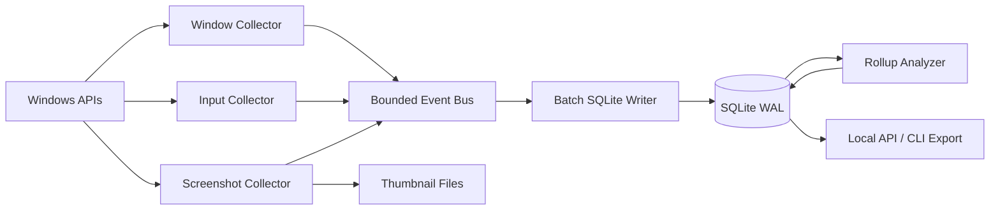

# Time State Recorder - OSS Research and Architecture

Date: 2026-05-23

## Goal Contract

目标：为一个 Windows-first 的本地时间记录软件提出研究充分、可落地的架构。软件需要识别每天在电脑上的工作状态，把 raw data 留存在本地数据库中，方便后续集合分析。

上下文：

- 当前仓库：`D:\CodexInfra`
- 目标用户：个人使用者，中文输入场景优先，重点关注窗口活动、键盘输入、输入法提交文本、删除编辑行为、后续截图缩略图。
- 本次任务不写业务代码，只产出开源工具调研、源码架构批判和自有架构方案。

完成标准：

- 记录调研过的开源仓库、源码入口、关键架构取舍。
- 明确至少覆盖 3 个功能：活跃窗口进程监控、键盘输入与输入法输出监控并单独处理 Backspace/Delete、屏幕活跃时每 1 分钟截图缩略图。
- 给出数据库 raw data 设计、模块边界、隐私安全约束、验证方法和残余风险。

## Research Scope

本次重点查看以下开源仓库和官方 API 文档。源码为 2026-05-23 临时 clone 后分析。

| 项目 | 用途 | 分析版本 | 关键源码 |
| --- | --- | --- | --- |
| ActivityWatch `aw-watcher-window` | 活跃窗口 watcher | `1370d290a47ed6ed3d409cebaea8ecbae7c01b15` | `aw_watcher_window/main.py`, `lib.py`, `windows.py` |
| ActivityWatch `aw-watcher-input` | 键鼠活动计数 watcher | `9bb5045456524b215ae11f422b80ec728c93bac7` | `src/aw_watcher_input/main.py` |
| screenpipe | 本地屏幕/音频/可访问性记忆 | `1078f0b5f46eb40583633f971f04577e8161f168` | `crates/screenpipe-a11y`, `screenpipe-capture`, `screenpipe-db`, `screenpipe-engine` |
| arbtt | 自动规则化时间跟踪 | `52a00557fff1606152f78ebf7292780430ba884d` | `src/capture-main.hs`, `src/Data.hs`, `src/Capture/Win32.hs` |
| KeyCastOW | Windows 按键可视化 | `eb51027bc5d64aeef84a6b9b85301d058ccefea7` | `keylog.cpp`, `keycast.cpp` |
| espanso | 跨平台文本扩展器 | `7a1e62826141a52632f23ef886c81ae659090f74` | `espanso-detect/src/win32`, `espanso-engine/src/process/middleware/matcher.rs` |

仓库链接：

- ActivityWatch window watcher: https://github.com/ActivityWatch/aw-watcher-window
- ActivityWatch input watcher: https://github.com/ActivityWatch/aw-watcher-input
- screenpipe: https://github.com/screenpipe/screenpipe
- arbtt: https://github.com/nomeata/arbtt
- KeyCastOW: https://github.com/brookhong/KeyCastOW
- espanso: https://github.com/espanso/espanso

关键源码链接：

- `aw-watcher-window/main.py`: https://github.com/ActivityWatch/aw-watcher-window/blob/1370d290a47ed6ed3d409cebaea8ecbae7c01b15/aw_watcher_window/main.py
- `aw-watcher-window/windows.py`: https://github.com/ActivityWatch/aw-watcher-window/blob/1370d290a47ed6ed3d409cebaea8ecbae7c01b15/aw_watcher_window/windows.py
- `aw-watcher-input/main.py`: https://github.com/ActivityWatch/aw-watcher-input/blob/9bb5045456524b215ae11f422b80ec728c93bac7/src/aw_watcher_input/main.py
- `screenpipe-a11y/windows.rs`: https://github.com/screenpipe/screenpipe/blob/1078f0b5f46eb40583633f971f04577e8161f168/crates/screenpipe-a11y/src/platform/windows.rs
- `screenpipe-capture/paired_capture.rs`: https://github.com/screenpipe/screenpipe/blob/1078f0b5f46eb40583633f971f04577e8161f168/crates/screenpipe-capture/src/paired_capture.rs
- `screenpipe-db/ui_events migration`: https://github.com/screenpipe/screenpipe/blob/1078f0b5f46eb40583633f971f04577e8161f168/crates/screenpipe-db/src/migrations/20250202000000_add_accessibility_and_input_tables.sql
- `arbtt/capture-main.hs`: https://github.com/nomeata/arbtt/blob/52a00557fff1606152f78ebf7292780430ba884d/src/capture-main.hs
- `KeyCastOW/keylog.cpp`: https://github.com/brookhong/KeyCastOW/blob/eb51027bc5d64aeef84a6b9b85301d058ccefea7/keylog.cpp
- `espanso/win32 native.cpp`: https://github.com/espanso/espanso/blob/7a1e62826141a52632f23ef886c81ae659090f74/espanso-detect/src/win32/native.cpp
- `espanso/matcher.rs`: https://github.com/espanso/espanso/blob/7a1e62826141a52632f23ef886c81ae659090f74/espanso-engine/src/process/middleware/matcher.rs

主要外部资料：

- ActivityWatch 架构文档：服务端存储 bucket，watcher 负责采集，UI 通过 REST API 读取。
- Microsoft Raw Input：应用需要注册设备，通过 `WM_INPUT` 接收原始键鼠输入，可区分设备来源。
- Microsoft Low Level Keyboard Hook：`WH_KEYBOARD_LL` hook 必须快速返回，系统建议低层 hook 把工作移交给 worker。
- Microsoft Text Services Framework：TSF 面向高级文本输入、IME、手写、语音等文本服务。
- Microsoft UI Automation：可从焦点元素、窗口句柄、树遍历获取 UI 元素和文本，但遍历资源开销较高。
- Microsoft Windows Graphics Capture：可捕获显示器或窗口帧，强调用户选择和系统可见边界。

外部资料链接：

- ActivityWatch architecture: https://docs.activitywatch.net/en/latest/architecture.html
- Microsoft Raw Input overview: https://learn.microsoft.com/en-us/windows/win32/inputdev/about-raw-input
- Microsoft `SetWindowsHookEx`: https://learn.microsoft.com/en-us/windows/win32/api/winuser/nf-winuser-setwindowshookexa
- Microsoft `LowLevelKeyboardProc`: https://learn.microsoft.com/en-us/windows/win32/winmsg/lowlevelkeyboardproc
- Microsoft `ToUnicodeEx`: https://learn.microsoft.com/en-us/windows/win32/api/winuser/nf-winuser-tounicodeex
- Microsoft Text Services Framework: https://learn.microsoft.com/en-us/windows/win32/tsf/text-services-framework
- Microsoft UI Automation elements: https://learn.microsoft.com/en-us/windows/win32/winauto/uiauto-obtainingelements
- Microsoft screen capture: https://learn.microsoft.com/en-us/windows/apps/develop/media-authoring-processing/screen-capture

## Open Source Findings

### ActivityWatch

ActivityWatch 的核心优点是边界清楚：server 存事件，watcher 独立采集，client 通过 heartbeat 写入。`aw-watcher-window` 每次轮询当前窗口，把 `app` 和 `title` 写成 `currentwindow` 事件；Windows 端用 `GetForegroundWindow`、`GetWindowText`、进程路径或 WMI fallback 获取进程名。

批判：

- 适合作为窗口状态监控的基线，但轮询模型会在快速切换窗口时丢细节。
- 标题直接入库有隐私风险，需要应用/窗口级排除和标题脱敏。
- UAC、锁屏、secure desktop 会返回空窗口，必须把这些状态显式记录为 `capture_unavailable`，不能默默缺失。
- `aw-watcher-input` 明确只统计按键次数和鼠标移动，不记录按了哪个键。这是正确的隐私边界，但不足以满足本项目的输入法和删除语义需求。

可借鉴：watcher/server 分离、event type、heartbeat 合并、查询层和采集层分离。

### Screenpipe

Screenpipe 是最接近“个人本地记忆”的项目。它使用 Rust workspace，包含可访问性树、UI event、截图、OCR、SQLite、REST API、Tauri UI。其文档描述 event-driven capture：app switch、click、typing pause、scroll stop、idle timer 触发截图和 accessibility tree，截图写到文件系统，元数据写 SQLite。

源码亮点：

- `screenpipe-a11y` 在 Windows 上安装键盘和鼠标 hook，hook 内只做轻量处理，并把 clipboard/PII 等重工作延后到 message loop。
- `ActivityFeed` 只记录活动时间和键盘 burst，用于调节 capture 频率，不记录内容。
- `screenpipe-capture` 做 paired capture：同一时间点写截图、可访问性文本、OCR fallback、frame 元数据。
- 数据库中有 `ui_events`、`frames`、`accessibility_text`、`snapshot_path`、FTS 索引等结构。

批判：

- 功能面很大，适合参考，不适合作为第一版直接 fork。它把 audio、AI、MCP、agent、cloud sync、timeline 都放进一个大系统，会抬高 MVP 的复杂度。
- 当前 Windows 文本转字符逻辑在一处源码里是手写 `vk_to_char` 映射，只覆盖英文键盘常见字符，不能可靠处理中文 IME committed text。
- Backspace 被用于 `text_buf.pop()`，Delete 返回 `None`，缺少“删除光标后字符”的语义模型。
- event-driven 截图很强，但本项目第一版只要求“屏幕活跃时每 1 分钟缩略图”，不需要 5 FPS 或 OCR-first 的高成本路径。

可借鉴：paired capture、SQLite schema、截图文件分层、活动 feed、低延迟 hook 约束、隐私过滤开关。

### Arbtt

Arbtt 每分钟记录桌面窗口列表、标题、哪个窗口 active，以及 idle 状态，然后用配置语言把 raw window title 映射为标签。

批判：

- “raw capture + later categorization”非常适合本项目的数据分析理念。
- 采样频率默认 60 秒，适合时间统计，不适合精准窗口切换和输入事件。
- Haskell + 自有二进制 log 对扩展输入、截图、FTS 查询不够方便。

可借鉴：把 raw data 和规则化分析拆开，先记录事实，之后通过 rules/queries 生成工作状态。

### KeyCastOW

KeyCastOW 是小型 Windows keystroke visualizer。它用 `SetWindowsHookEx(WH_KEYBOARD_LL)` 和 `WH_MOUSE_LL` 安装 hook，有 message loop 和 hotkey 开关。字符转换用 `ToUnicodeEx`，特殊键列表包含 Backspace 和 Delete。

批判：

- 低层 hook 和 `ToUnicodeEx` 是可用参考，但不能直接照搬为长期记录器。
- hook 回调里不能做数据库写入、截图、复杂正则或阻塞操作。
- 低层 hook 能看到物理键和部分字符转换，但看不到“中文输入法最终提交了哪些汉字”的可靠语义。

可借鉴：Windows hook 生命周期、hotkey 暂停、特殊键枚举、键盘 layout 处理。

### Espanso

Espanso 的 Windows 采集更值得参考。它使用 Raw Input 处理 `WM_INPUT`，从 `RAWINPUT` 获取键盘事件、设备来源、键盘 layout，并用 `ToUnicodeEx` 得到字符。它会过滤无明确 HID 来源的事件，避免把自己注入的事件再次当成用户输入。匹配器里对 Backspace 有明确的 buffer 回退逻辑。

批判：

- Raw Input 比 low-level hook 更适合作为“非阻塞、可区分设备来源”的默认输入采集路径。
- Espanso 主要目标是触发文本扩展，不是完整记录；它没有 Delete 语义，也不解决任意应用的 IME commit 采集。
- 用键盘事件还原文本只能覆盖一部分输入。中文 IME、候选词、语音输入、粘贴、自动补全都需要通过文本层或可访问性层补充。

可借鉴：Raw Input message window、layout 缓存、过滤软件注入事件、Backspace 对 buffer state 的处理。

## Architecture Recommendation

建议做一个 Windows-first、local-first、事件溯源式 recorder。不要 fork ActivityWatch 或 Screenpipe，而是吸收它们的边界：

- 采集层只产出 append-only raw events。
- 写入层负责批量落库、加密、索引和保留策略。
- 分析层从 raw events 派生每日状态、分钟聚合和项目时间。
- UI/API 只读查询，不直接参与采集。

推荐技术栈：

- Core agent：Rust。原因是 Windows API、Raw Input、UI Automation、截图、SQLite writer 都需要低延迟和稳定长驻。
- UI：Tauri 或独立 tray app。第一版可以只做 tray、暂停/恢复、配置窗口、导出命令。
- Storage：SQLite WAL。后续可加 SQLCipher 或 OS 密钥保护。截图缩略图放文件系统，DB 只存路径、hash、尺寸、触发原因。
- Query/export：本地 HTTP API 或 CLI，导出 JSON/Markdown/Parquet。

## Modules

### 1. Agent Supervisor

职责：

- 启动和监控 collectors。
- 维护 tray 状态：recording/paused/private window/locked/error。
- 读取配置：采集级别、排除应用、排除窗口、截图保留天数、是否保存文本内容。
- 监听锁屏、睡眠、用户切换、电源状态。

原则：

- 永远可见，不做 stealth 采集。
- 默认本地保存，不上传。
- 支持全局暂停热键。

### 2. Window Collector

职责：

- 记录 foreground window、进程名、PID、窗口标题、可执行路径 hash、窗口句柄、browser URL 可选。
- 事件源优先使用 `SetWinEventHook(EVENT_SYSTEM_FOREGROUND, EVENT_OBJECT_NAMECHANGE)`，再用 1 秒轮询兜底。
- 生成 `window_focus` raw event，并由分析层合成 `window_intervals`。

字段建议：

- `event_ts`, `hwnd`, `pid`, `process_name`, `exe_path_hash`, `window_title`, `window_title_redacted`, `integrity_level`, `capture_status`

关键处理：

- UAC/lock screen/secure desktop 记录为特殊状态。
- 管理员窗口无法读取时，记录 `permission_denied`，不要默认提权。
- 标题按配置保存 raw、hash 或 redacted。

### 3. Input Collector

输入采集分三层，避免把“按键”和“文本”混为一谈。

Layer A - Activity signal：

- 只记录最近键鼠活动时间和计数。
- 用于判断屏幕是否活跃、是否应截图、是否 AFK。
- 即使用户关闭文本记录，也保留这一层。

Layer B - Physical key events：

- 默认使用 Raw Input：隐藏 message-only window 注册 keyboard/mouse，接收 `WM_INPUT`。
- 记录 keydown/keyup、virtual key、scan code、modifiers、keyboard layout、device id、target window id。
- Low-level hook 只作为 fallback，用于 Raw Input 不可用或需要快捷键暂停时。

Layer C - Text edit events：

- 不尝试只靠 key code 还原文本。
- 对焦点文本控件使用 UI Automation：`GetFocusedElement`、`ValuePattern`、`TextPattern`、selection/caret 信息，在输入 debounce 后读取 before/after snapshot 并做 diff。
- 记录 committed text delta，而不是 IME composition 中间态。
- 对 UIA 不可用的应用，fallback 到 `ToUnicodeEx` 产生的字符流，并标记 `confidence=low`。
- 如果后续验证发现 UIA 对中文 IME 覆盖不足，再增加 TSF text service 作为高级采集插件。

Backspace/Delete 语义：

- `VK_BACK` 和 `VK_DELETE` 永远作为独立 `edit_intent` 记录，不能混成普通字符。
- Backspace：先记录 `delete_before_cursor(count=1)`。
- Delete：先记录 `delete_after_cursor(count=1)`。
- 如果 UIA diff 成功，补充实际删除范围和被删除文本长度。是否保存 deleted_text 由隐私级别控制。
- 如果 UIA diff 失败，只保存删除方向、次数、目标 app/window、时间戳。
- 所有字符串按 Unicode grapheme cluster 处理，不能按 byte 或 UTF-16 code unit 简单截断。

### 4. Screenshot Thumbnail Collector

职责：

- 每 1 分钟检查一次：用户活跃、屏幕未锁、当前窗口不在排除列表、距离上次截图满 60 秒。
- 捕获当前 active monitor 或全桌面缩略图。
- 第一版只保存 thumbnail，建议最大宽度 640 或 960，JPEG/WebP，质量 60-75。
- 计算 perceptual hash/content hash，重复画面可跳过或只记录 heartbeat。

Windows 捕获方案：

- 优先 Windows Graphics Capture，用用户显式选择的 display/window，并保留系统可见边界。
- 如果要求后台无选择框、全局长期捕获，再评估 Desktop Duplication API，但需要更强的隐私提示和配置界面。

字段建议：

- `snapshot_ts`, `window_event_id`, `active_pid`, `monitor_id`, `thumbnail_path`, `width`, `height`, `image_hash`, `capture_reason='active_1min'`, `redaction_status`

### 5. Event Bus and Writer

职责：

- Collectors 只向 bounded channel 投递事件。
- 写入线程按 100-1000ms 或 N 条事件批量写入 SQLite。
- hook/message callback 内不做 DB、截图、OCR、PII 正则、网络请求。
- 队列满时优先降级：保留 activity/window，丢弃 mouse move，压缩 key repeat，记录 `dropped_event_count`。

## Proposed Data Model

核心原则：raw events append-only，派生表可重建。

```sql
CREATE TABLE capture_sessions (
  id TEXT PRIMARY KEY,
  started_at TEXT NOT NULL,
  ended_at TEXT,
  host_id TEXT NOT NULL,
  app_version TEXT NOT NULL,
  config_hash TEXT NOT NULL
);

CREATE TABLE raw_events (
  id INTEGER PRIMARY KEY AUTOINCREMENT,
  session_id TEXT NOT NULL,
  event_ts TEXT NOT NULL,
  event_type TEXT NOT NULL,
  source TEXT NOT NULL,
  target_window_id INTEGER,
  payload_json TEXT NOT NULL,
  privacy_level TEXT NOT NULL DEFAULT 'normal'
);

CREATE TABLE window_events (
  raw_event_id INTEGER PRIMARY KEY,
  hwnd INTEGER,
  pid INTEGER,
  process_name TEXT,
  exe_path_hash TEXT,
  window_title TEXT,
  browser_url TEXT,
  capture_status TEXT NOT NULL,
  FOREIGN KEY(raw_event_id) REFERENCES raw_events(id)
);

CREATE TABLE physical_key_events (
  raw_event_id INTEGER PRIMARY KEY,
  key_action TEXT NOT NULL,
  vk_code INTEGER NOT NULL,
  scan_code INTEGER,
  modifiers INTEGER NOT NULL,
  layout_id TEXT,
  device_hash TEXT,
  repeat_count INTEGER DEFAULT 1,
  injected INTEGER DEFAULT 0,
  FOREIGN KEY(raw_event_id) REFERENCES raw_events(id)
);

CREATE TABLE text_edit_events (
  raw_event_id INTEGER PRIMARY KEY,
  edit_kind TEXT NOT NULL,
  committed_text TEXT,
  deleted_text TEXT,
  grapheme_count INTEGER,
  cursor_before INTEGER,
  cursor_after INTEGER,
  confidence TEXT NOT NULL,
  method TEXT NOT NULL,
  FOREIGN KEY(raw_event_id) REFERENCES raw_events(id)
);

CREATE TABLE screenshot_thumbnails (
  raw_event_id INTEGER PRIMARY KEY,
  thumbnail_path TEXT NOT NULL,
  width INTEGER NOT NULL,
  height INTEGER NOT NULL,
  image_hash TEXT NOT NULL,
  active_window_event_id INTEGER,
  capture_reason TEXT NOT NULL,
  FOREIGN KEY(raw_event_id) REFERENCES raw_events(id)
);

CREATE TABLE minute_rollups (
  minute_start TEXT PRIMARY KEY,
  active_seconds INTEGER NOT NULL,
  dominant_process TEXT,
  dominant_window_hash TEXT,
  keypress_count INTEGER,
  text_insert_graphemes INTEGER,
  text_delete_graphemes INTEGER,
  screenshot_count INTEGER
);
```

`payload_json` 保存原始结构，专用表保存常查字段。这样后续可以扩展事件而不频繁迁移所有 raw data。

## Data Flow



## MVP Feature Specification

### Feature 1 - 活跃窗口进程监控

必须记录：

- 窗口获得焦点时间。
- 进程名、PID、窗口标题、可执行路径 hash。
- 采集失败状态。

完成标准：

- 在 Notepad、Chrome、VS Code、Explorer 间切换，DB 中有顺序正确的 `window_focus` 事件。
- 1 分钟 rollup 能计算每个应用活跃秒数。

### Feature 2 - 键盘输入和输入法输出

必须记录：

- physical keydown/keyup 事件。
- text edit 事件：insert、delete_before_cursor、delete_after_cursor、replace、paste。
- Backspace 和 Delete 独立语义。
- IME committed text 尽量通过 UIA diff 获取，不能把拼音中间态当成最终文本。

完成标准：

- 英文输入 `abc`, Backspace 后，产生 insert `abc` 和 delete_before_cursor。
- 中文拼音输入并提交 `你好` 后，记录 committed text `你好`，不把 `nihao` 当最终文本。
- Delete 删除光标后字符时，记录 delete_after_cursor。
- UIA 不可用时，事件标记 `confidence=low` 或 `method=fallback_key_translation`。

### Feature 3 - 活跃屏幕 1 分钟缩略图

必须记录：

- 用户活跃时每 60 秒最多一张缩略图。
- 锁屏、暂停、排除窗口、无活动时不截图。
- DB 存路径、hash、尺寸、关联窗口。

完成标准：

- 连续活跃 3 分钟，生成约 3 张缩略图和对应 DB 行。
- AFK 超过阈值后不新增截图。
- 排除窗口激活时不截图。

## Privacy and Safety Rules

这些规则应该进入产品默认行为，而不是文档附录：

- 显式 tray 状态和暂停按钮。
- 默认不上传，默认不开 cloud sync。
- 默认不保存密码框文本。UIA 标记 `IsPassword` 或浏览器密码字段时，只记录 activity，不记录 text/screenshot。
- 默认保留截图缩略图，不保留全分辨率截图。
- 支持 app/window blocklist：密码管理器、银行、医疗、聊天、浏览器隐身窗口。
- 支持数据保留策略：raw key events 7-30 天，rollup 长期保留，截图更短。
- 加密本地数据库或至少支持数据库目录加密。
- 导出时生成 provenance：时间范围、配置 hash、导出命令、字段脱敏级别。

## Verification Plan

单元测试：

- Unicode grapheme diff：英文、中文、emoji、组合字符。
- 编辑模型：insert、Backspace、Delete、selection replace、paste。
- 队列降级：高频输入时不阻塞、不丢 window state。

Windows 集成测试：

- Notepad：英文、中文 IME、Backspace、Delete。
- VS Code/Electron：编辑器输入、窗口标题变化、UIA 可用性。
- Chrome：网页输入框、密码框、隐身窗口。
- 管理员窗口/UAC/锁屏：记录不可采集状态。

性能验收：

- 输入 callback 内不做阻塞工作。
- 长时间输入无明显键盘延迟。
- SQLite writer 批量写入，WAL 文件可控。
- 缩略图每 1 分钟捕获时 CPU 峰值可接受，单日存储量可预估。

数据验收：

- 任意一天可从 raw events 重建 minute rollups。
- 删除 derived tables 后可重新生成一致结果。
- 截图文件缺失时 DB 能标记 orphan，不破坏其他查询。

## Residual Risks

- IME committed text 是最大技术风险。Raw Input 和 low-level hook 都不是完整答案；UIA diff 覆盖率取决于目标应用。TSF 插件可能是后续必要工作。
- 保存输入文本和截图高度敏感，必须先做本地可见、可暂停、可排除、可删除，再扩大采集范围。
- 一些应用、游戏、远程桌面、管理员窗口、浏览器安全字段会拒绝或限制可访问性文本。
- Windows Graphics Capture 的用户授权模型和长期后台捕获需求可能冲突，需要在产品伦理和技术便利之间明确取舍。
- 如果后续要跨平台，macOS Accessibility、Linux X11/Wayland/AT-SPI 会带来完全不同的权限和输入模型，不应塞进 Windows MVP。

## Recommended Next Step

下一步不是直接编码，而是写一个更小的 implementation plan：

1. 只做 Windows MVP。
2. 先实现 DB schema、window collector、activity-only input collector。
3. 再实现 physical key events 和 text edit diff。
4. 最后接入 1 分钟缩略图。

每一步都要有可运行的验证脚本和一份匿名样例数据库。
